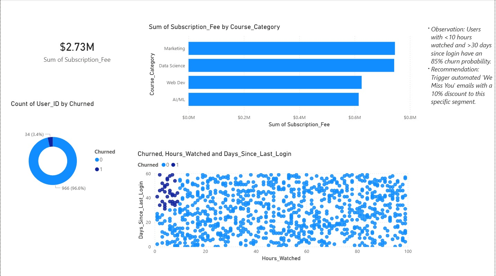

# EdTech Subscription & Churn Analysis 🎓📊

## 🚀 Business Case
In the Tech Solutions and EdTech sectors, customer retention is the primary driver of Monthly Recurring Revenue (MRR). This project analyzes a simulated dataset of **1,000+ student subscriptions** to identify behavioral patterns, calculate key financial KPIs, and build a predictive model to mitigate user churn.

## 🛠️ The Data Stack
* **Data Generation:** Python (NumPy/Pandas) to create a robust dataset with realistic business logic (Engagement vs. Retention).
* **Data Extraction & Manipulation:** **SQL (SQLite)** for revenue aggregation, multi-dimensional grouping, and behavioral segmentation.
* **Predictive Modeling:** **Scikit-Learn** (Logistic Regression) to classify "at-risk" users based on engagement metrics.
* **Business Intelligence:** **Power BI** for high-fidelity dashboarding, DAX measures, and executive reporting.

## 📊 Executive Dashboard


📂 **[Download Full PDF Report](edtech_dashboard.pdf)**

### Key Performance Indicators (KPIs)
* **Total Revenue:** Aggregated fees across all course categories, formatted for executive review.
* **Retention Rate:** A real-time visual of active users vs. churned accounts.
* **Market Demand:** Revenue distribution identifying high-growth segments like AI and Data Science.
* **Engagement Decay:** A trend analysis showing the "Danger Zone" where low engagement meets high inactivity.

## 🔍 Technical Highlights

### 1. SQL-Driven Business Intelligence
I utilized SQL to perform deep-dive segmentation, identifying users who are currently active but show "Pre-Churn" indicators (Inactivity > 20 days).
```sql
-- 1. Multi-Dimensional Revenue Analysis
-- Aggregating total revenue and average fee by category to identify "Cash Cows."
SELECT 
    Course_Category, 
    COUNT(User_ID) AS Total_Students,
    SUM(Subscription_Fee) AS Gross_Revenue,
    ROUND(AVG(Subscription_Fee), 2) AS Average_ARPU
FROM subscriptions
GROUP BY Course_Category
ORDER BY Gross_Revenue DESC;

-- 2. Behavioral Segmentation (At-Risk Users)
-- Identifying "Active" students with high inactivity (>20 days) for retention targeting.
SELECT User_ID, Course_Category, Days_Since_Last_Login
FROM subscriptions
WHERE Days_Since_Last_Login > 20 AND Churned = 0;
-- 3. Advanced Engagement Query (Subquery Logic)
-- Comparing individual student watch time against the platform average.
SELECT 
    User_ID, 
    Hours_Watched,
    (SELECT AVG(Hours_Watched) FROM subscriptions) AS Global_Avg_Hours
FROM subscriptions
WHERE Hours_Watched < (SELECT AVG(Hours_Watched) FROM subscriptions)
AND Churned = 0;

```
### Actionable Recommendations
Based on the data findings, I proposed the following strategies for Elythra Edufyi:

1.Automated Re-engagement: Trigger personalized "We Miss You" notifications for users crossing the 15-day inactivity threshold.

2.Gamified Learning: Since quiz participation significantly correlates with lower churn, implement a "Learning Streak" system to boost weekly activity.

3.High-Value Allocation: Increase marketing ROI by scaling spend in categories with the highest Lifetime Value (LTV).
